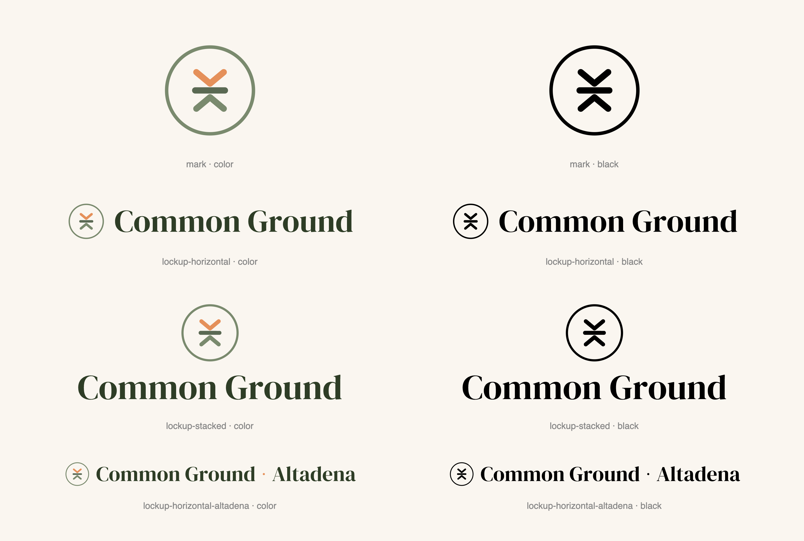

# Common Ground — Logo Kit

Official logo artifacts for **Common Ground**, the community engagement framework for the Altadena rebuild. Free to use on Common Ground materials.

## Download

- **Just need a file?** Open the [`png/`](png) folder (transparent background, works everywhere) and download what you need.
- **Designer or printer?** Use [`svg/`](svg) (vector, scalable) or [`pdf/`](pdf) (vector, print-ready).
- **Want everything?** Click the green **Code** button above → **Download ZIP**.

## What's inside

| Folder | Format | Best for |
|---|---|---|
| `png/` | Transparent PNG, high-res | Docs, slides, Canva, social — use if unsure |
| `svg/` | Vector (outlined, no fonts needed) | Web, design tools, large print, signage |
| `pdf/` | Vector, print-ready | Flyers, banners, swag at a print shop |

### Lockups
Each comes in **color**, **black** (1-color), and **white** (reverse).

| Name | Use |
|---|---|
| `mark` | The circle symbol alone — avatars, favicons, stamps |
| `lockup-horizontal` | Symbol + “Common Ground” — the default logo |
| `lockup-stacked` | Symbol above the wordmark — square-ish spaces |
| `lockup-horizontal-altadena` | “Common Ground · Altadena” — when location helps |

> **color** → on white/light backgrounds · **black** → one-color print · **white** → on dark backgrounds only (it’s invisible on white — that’s expected).

## Brand

| | |
|---|---|
| Forest | `#2E3D26` |
| Cream | `#FAF6F0` |
| Sage | `#7A8A6E` |
| Sage dark | `#5A6953` |
| Coral | `#E5905A` |

**Typefaces:** DM Serif Display (wordmark) · DM Sans (text). Both free from [Google Fonts](https://fonts.google.com). The logo files don’t require them.

## Using it well

- Keep clear space around the logo — at least the height of the circle mark.
- Don’t recolor, stretch, rotate, or add effects.
- On photos or busy backgrounds, use the white version over a dark area.

Questions: **commongroundaltadena@gmail.com**
